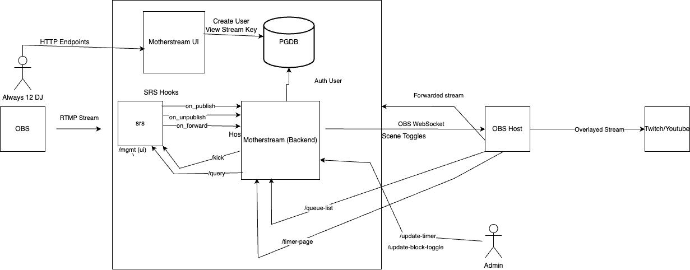

# Motherstream

The Motherstream hosts a frontend and backend. The backend is responsible for RTMP hooks that are triggered upon a request to stream to [SRS](https://github.com/ossrs/srs) as well as many other endpoints to control the stream queue. The frontend allows users to create an account that generates them a stream key. That stream key can then be used to authenticate to the motherstream stream queue. Once a user is in the front of the queue, the user's stream is forwarded to a streaming platform.

(WIP: Multistream across platforms)

It is designed to assist with automated stream management for livestreams where multiple users can export to one stream, entirely uninterrupted.

## Architecture Diagram



## Table of Contents

1. [Introduction](#introduction)
1. [Frontend](#frontend)
2. [Requirements](#requirements)
3. [Installation](#installation)
4. [Environment Variables](#environment-variables)
5. [API Endpoints](#api-endpoints)
6. [Queue Management](#queue-management)
7. [OBS Integration](#obs-integration)

## Introduction

This application handles RTMP streaming with a queue mechanism that manages the state of SRS/Oryx. It includes administrative endpoints for managing the queue and setting time limits on streamers

The repo has the following main features:

- A frontend to allow streamers to create an account, which generates a unique stream key used for stream authentication 
- Manage a queue of incoming streams. with rtmp directive hooks.
- Start and stop the current stream.
- Persist the queue state to a file.
- Provide an HTML view of the queue.
- Integrate with OBS (Open Broadcaster Software) for scene management when a stream ends to perform cleanup events.

## Frontend

Check out the [frontend README](frontend/README.md) for information on how to run it locally.

## Requirements

- Python 3.12+
- npm (for the frontend)
- conda for python environment management
- direnv for environment management (See: .envrc.sample)


## Environment Variables

The application requires several environment variables:

- `HOST`: The streaming server host (e.g., `localhost`).
- `NGINX_RTMP_PORT`: The RTMP port (e.g., `1935`).
- `OBS_HOST`: OBS WebSocket server host (e.g., `localhost`).
- `OBS_PORT`: OBS WebSocket server port (e.g., `4444`).
- `OBS_PASSWORD`: OBS WebSocket server password (optional).
- `DEBUG_PORT`: Debugging port for `debugpy` (default: `5555`).
- `SENTRY_DSN`: Sentry DSN for distributed tracing
- `STAT_PORT`: port where nginx control/stat modules are listening on
- `JWT_SECRET`: Secret used for user hashing
- `DISCORD_WEBHOOK_URL`: Discord webhook url to announce the start and end of a stream
- `TOGGLE_DISCORD_NOTIFICATIONS`: flag to enable or disable discord notifications
- `RECORD_DIR`: Nginx stream record directory
- `RECORD_STREAM`: Only forward rtmp stream to nginx if truthy value
- `VITE_API_URL`: Backend API (motherstream) URL
- `DB_HOST`: database host
- `DB_PORT`: database port
- `DB_PASSWORD`: database password
- `DB_NAME`: database name
- `DB_USER`: database user
- `SHAZAMING`: bool to enable/disable shazam functionality

These variables can be set in the environment with [direnv](https://direnv.net/docs/installation.html). Make your own `.envrc.sample`

## Installation

1. Clone the repository:

```sh
git clone https://github.com/danielamar101/motherstream
cd motherstream
```

2. Create a virtual environment and activate it:

```sh
conda create -f environment.yml
conda activate motherstream
```

3. Install the required dependencies:

```sh
pip install -r requirements.txt
```

4. Set up environment variables as described below.

5. Run the application:

```sh
./start-dev.sh <--- With reloading
./start.sh <-- no reloading
```

## API Endpoints 

- `GET /queue-list`: Returns an HTML page displaying the current queue.
- `GET /queue-json`: Returns the current queue as a JSON array.
- `POST /update-timer/{time_in_seconds}?reset_time=<boolean>` Controls the amount of time left on a stream before kick.
- `GET /time-settings`: Returns a json object showing swap interval and remaining time in a stream
- `POST /block-toggle/`: Controls whether a kicked user is immediately allowed to re-connect to the stream
- `GET /block-toggle`: Returns false if a kicked user is immediately allowed to re-connect to the stream
- `POST /multi-dj-per-stream`: (WIP)

## SRS HTTP Callback RTMP hooks and dynamic forwarding:

- [HTTP Callback](https://ossrs.io/lts/en-us/docs/v5/doc/getting-started-oryx#http-callback)
- [Dynamic Forwarding](https://ossrs.io/lts/en-us/docs/v5/doc/forward#dynamic-forward)

## Queue Management

The stream queue is managed using a list stored in memory and persisted to a file (`QUEUE.json`). The server periodically checks the queue, starts the next stream if no active streams are running, and removes streams from the queue when they finish.


## OBS Integration

When a stream ends, the application interacts with OBS via WebSockets to manage scenes, enabling a seamless transition between streams. The connection to OBS is configured using the `OBS_HOST`, `OBS_PORT`, and `OBS_PASSWORD` environment variables.

## Development

During development, the application can be run with `uvicorn` and has built-in support for `debugpy` for remote debugging.

## Contributing

Contributions are welcome! Please submit issues or pull requests to help improve the project.

## License

This project is licensed under the MIT License. See the `LICENSE` file for details.
