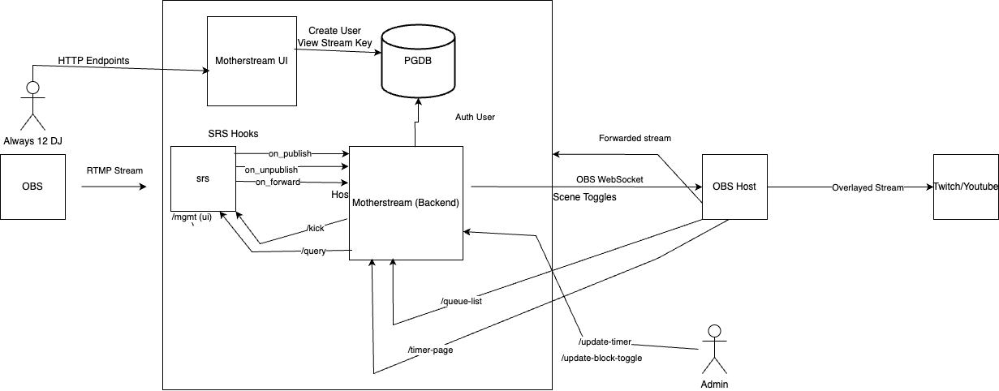

# Motherstream

The Motherstream hosts a containeried frontend and backend. The backend is responsible for RTMP hooks that are triggered upon a request to stream to [SRS](https://github.com/ossrs/srs). The frontend allows users to create an account that generates them a stream key. That stream key can then be used to authenticate to the motherstream stream queue. Once a user is in the front of the queue, the user's stream is forwarded to a streaming platform.
(TODO: Multistream across platforms)

It is designed to assist with automated stream management for livestreams where multiple users can export to one stream, almost entirely uninterrupted.

## Architecture Diagram



## Table of Contents

1. [Introduction](#introduction)
2. [Requirements](#requirements)
3. [Installation](#installation)
4. [Environment Variables](#environment-variables)
5. [API Endpoints](#api-endpoints)
6. [Queue Management](#queue-management)
7. [OBS Integration](#obs-integration)

## Introduction

This application handles RTMP streaming with a queue mechanism that manages the state of SRS/Oryx. It includes administrative endpoints for managing the queue and setting time limits on streamers

The application has the following main features:

- Manage a queue of incoming streams. with rtmp directive hooks.
- Start and stop the current stream.
- Persist the queue state to a file.
- Provide an HTML view of the queue.
- Integrate with OBS (Open Broadcaster Software) for scene management when a stream ends to perform cleanup events.
- WIP stream key -> DB lookup
- 

## Requirements

- Python 3.12+
- conda for environment management
- `ffmpeg` and `ffprobe` installed and available in the system PATH.
- `obsws` for OBS integration.
- direnv for environment management (See: .envrc.sample)

## Installation

1. Clone the repository:

```sh
git clone <repository_link>
cd <repository_directory>
```

2. Create a virtual environment and activate it:

```sh
conda create -f environment.yml
conda activate motherstream
```

3. Install the required dependencies:

```sh
pip install -r requirements.txt
```

4. Set up environment variables as described below.

5. Run the application:

```sh
./start-dev.sh <--- With reloading
./start.sh <-- no reloading
```

## Environment Variables

The application requires several environment variables:

- `HOST`: The streaming server host (e.g., `localhost`).
- `RTMP_PORT`: The RTMP port (e.g., `1935`).
- `OBS_HOST`: OBS WebSocket server host (e.g., `localhost`).
- `OBS_PORT`: OBS WebSocket server port (e.g., `4444`).
- `OBS_PASSWORD`: OBS WebSocket server password (optional).
- `DEBUG_PORT`: Debugging port for `debugpy` (default: `5555`).

These variables can be set in the environment or defined in a `.env` file.

## API Endpoints

- `GET /queue-list`: Returns an HTML page displaying the current queue.
- `GET /queue-json`: Returns the current queue as a JSON array.
- `GET /update-timer/{time_in_seconds}?reset_time=<boolean>` Controls the amount of time left on a stream before kick.
- `GET /update-block-toggle/`: Controls whether a kicked user is immediately allowed to re-connect to the stream


## Queue Management

The stream queue is managed using a list stored in memory and persisted to a file (`QUEUE.json`). The server periodically checks the queue, starts the next stream if no active streams are running, and removes streams from the queue when they finish.

The queue is updated using the `queue_client_stream` and `unqueue_client_stream` functions, ensuring consistency between the in-memory and persisted states.

## OBS Integration

When a stream ends, the application interacts with OBS via WebSockets to manage scenes, enabling a seamless transition between streams. The connection to OBS is configured using the `OBS_HOST`, `OBS_PORT`, and `OBS_PASSWORD` environment variables.

## Logging

FFmpeg output is logged to `ffmpeg.log`, and the application logs startup and shutdown events to standard output.

## Development

During development, the application can be run with `uvicorn` and has built-in support for `debugpy` for remote debugging.

## Contributing

Contributions are welcome! Please submit issues or pull requests to help improve the project.

## License

This project is licensed under the MIT License. See the `LICENSE` file for details.
